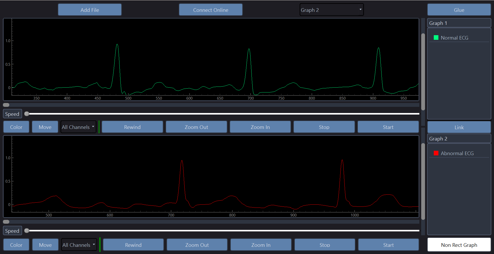
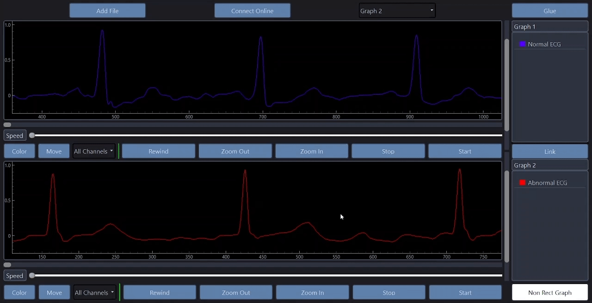
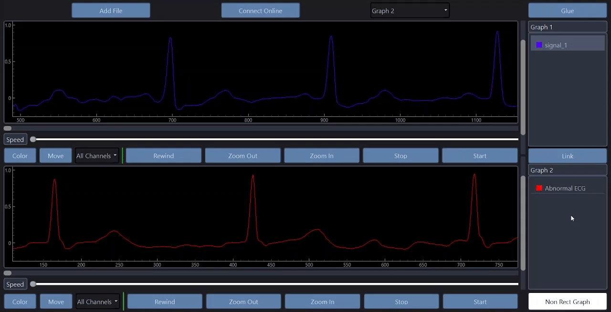
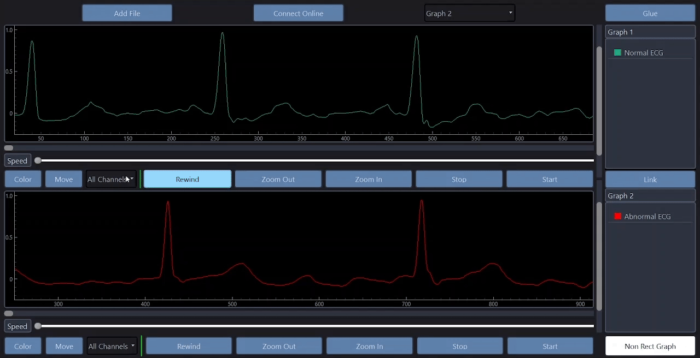
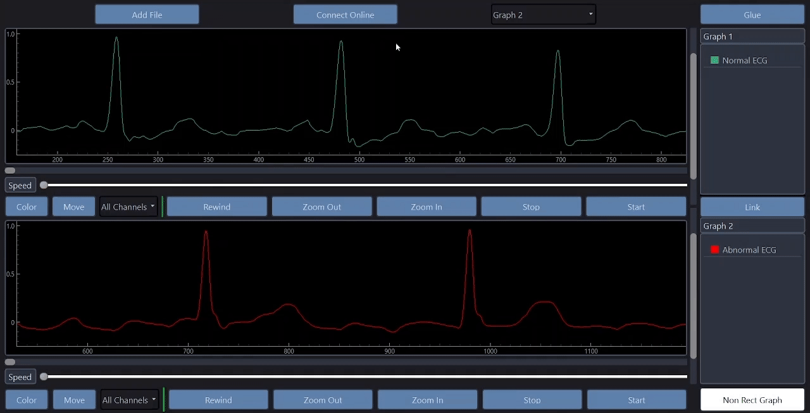
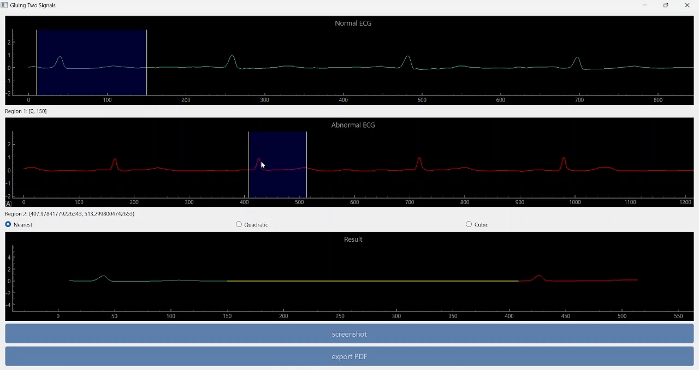
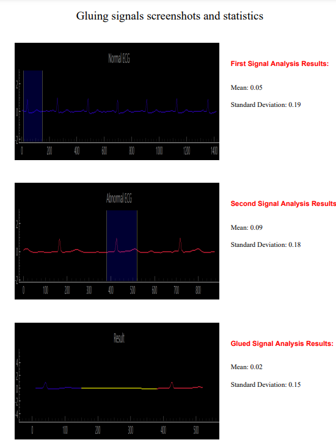

# Signal Viewer



## Description

- Desktop Application Designed For Signal Analysis
- User-Friendly Interface For Easy Visualization And Comparison Of Different Signals
- Handles Multi-Channel Signal Viewing, Allowing Flexible Control Over Each Signal
- Offers Extra Features Like Viewing A Live Signal In Real Time, Gluing Two Signals Togther

## Tech Stack Used

|**Functionality** | |
|--- | --- |
|**UI** | |
|**Styling** | [](#)|

## Features

- Browse & View A Signal File (Make Sure Its Format & Extension Are The Same As The Files Inside `signal` Directory)
   
- Play, Pause & Rewind The Signal


&nbsp;
- Change The Color Of The Signal
   

&nbsp;
- Change The Name Of The Signal
   

&nbsp;
- Show & Hide The Signal


&nbsp;
- Control The Speed Of The Signal Plotting
   

&nbsp;
- Link The Two Graphs Together, Ensuring Synchronized Control
   

&nbsp;
- Other Signal Manipulation Features Like Changing The Zoom & Pan Level, Moving The Signal Between The Two Graphs
  
- View A Real Time Signal Showcasing The Current Temperature In Cairo, Egypt Using `OpenWeather` API


&nbsp;
- Glue Two Signal Together With Different Interpolation Orders Of The Gap
  

&nbsp;
- Export The Gluing Results As A PDF


## Installation

1. Make Sure That Pip & Python Are Installed On Your System

2. Clone The Repo Onto Your Local System or Download The Zip File & Extract It
   ```bash
    git clone https://github.com/mostafa-aboelmagd/signal-viewer.git
    ```

3. Nagivate To The Project's Directory 
   
4. Install The Required Libraries
    ```bash
    pip install -r requirements.txt
    ```

5. Run `main.py` File
    ```bash
    python main.py
    ```

## Contributors

| Name | GitHub | LinkedIn |
| ---- | ------ | -------- |
| Mostafa Ayman | [](https://github.com/mostafa-aboelmagd) | [](https://www.linkedin.com/in/mostafa--aboelmagd/) |
| Ali Zayan | [](https://github.com/alizayan684) | [](https://www.linkedin.com/in/%D8%B9%D9%84%D9%8A-%D8%B2%D9%8A%D8%A7%D9%86-%F0%9F%94%BB%F0%9F%87%B5%F0%9F%87%B8-b98239264/) |
| Zeyad Amr | [](https://github.com/Zisco2002)| [](https://www.linkedin.com/in/zeyad-amr-3506b225b/) |
| Mostafa Mousa | [](https://github.com/MostafaMousaaa) | [](https://www.linkedin.com/in/mostafa-mousa-b81b8322a/) |
| Omar Khaled | [](#)| [](https://www.linkedin.com/in/omar-khaled-064b7930a/) |
